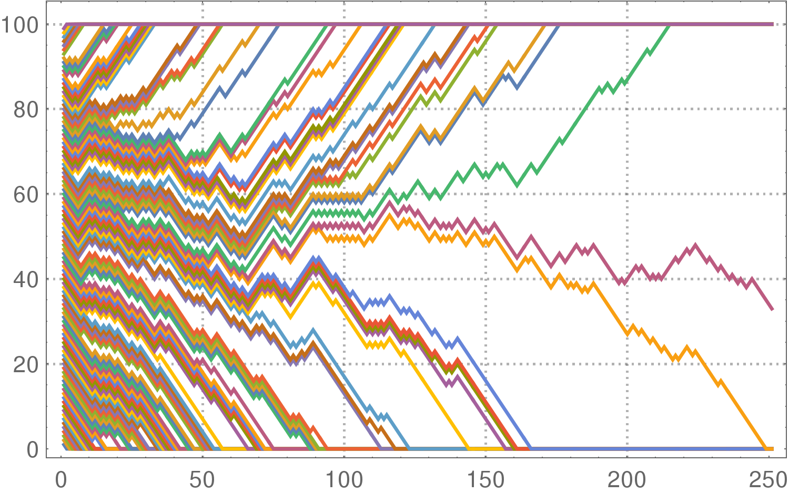

rain
=====
# Rain in Probland

Assume there is a known probability of rain today. If it rains today, the probability of rain tomorrow is higher than today. 
If it doesn't rain today, the probability of rain tomorrow is lower than today. The amount by which the probability changes from today to tomorrow is also known.
Once the probability of rain reaches `1.0`, the eternal rain starts. If it reaches `0.0`, the dry spell falls on Probland. 

`Question:` you start in state `Pi` (probability of rain today = `Pi`) and the step by which you increase/decrease the probability of rain tomorrow is `step`, what's the probability of eventually reaching state `Pj = 1.0`?

Illustration: step = 1/4, so the possible probability states are:

P0 = 0/4 = 0,

P1 = 1/4,

P2 = 2/4 = 1/2,

P3 = 3/4,

P4 = 4/4 = 1

The probability of eternal rain in state 4/4 is 1. It rains today with probability 1 and it's going to rain tomorrow with probability 1 and so forth. 

`Analytical solution:` The probabilty of eternal rain if we start in state Pi

PR4 = 4/4 = 1

PR3 = 3/4 * PR4 + 1/4 * PR2 

PR2 = 1/2 * PR3 + 1/2 * PR1

PR1 = 1/4 * PR2 + 3/4 * PR0

PR0 = 0/4 = 0

Solving this system of equations, we get PR0 = 0, PR1 = 1/8, PR2 = 1/2, PR3 = 7/8, PR4 = 1

`Simulated paths solution:` Start in a given state, simulate runs (all of them will terminate in 0 or 1), divide the sum of the results of all runs by the total number of runs. That ratio will converge to the theoretically computed one as the number of runs grows.

