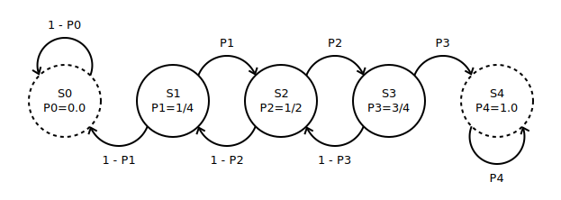

rain
=====
# Rain in Probland

Assume there is a known probability that it's going to rain today, let's call it `P`. 
If it rains today, the probability of rain tomorrow is `P + step`. 
If it doesn't rain today, the probability of rain tomorrow is `P - step`. 
Once the probability of rain reaches `1.0`, the eternal rain starts. If it reaches `0.0`, the dry spell falls on Probland. There are `N+1` possible states, `step = 1/N`

`Question:` Given that you start in state `Si` (probability of rain today is `Pi`) and the step by which you increase/decrease the probability of rain tomorrow is `step = 1/N`, what's the probability of eventually reaching state `Sn` with `Pn = 1.0`?

Illustration: 

    P0 = 0/4 = 0
    P1 = 1/4
    P2 = 2/4 = 1/2
    P3 = 3/4
    P4 = 4/4 = 1

The probability of eternal rain in `S4` is `P4 = 4/4 = 1`. In `S4`, it rains today with probability 1 and it's going to rain tomorrow with probability 1 and so forth. By the same logic, `P0 = 0`

`Analytical solution:` The probabilty of eternal rain if we start in `Si` is `Pri` 

    Pr4 = 1
    Pr3 = P3 * Pr4 + (1 - P3) * Pr2
    Pr2 = P2 * Pr3 + (1 - P2) * Pr1
    Pr1 = P1 * Pr2 + (1 - P1) * Pr0
    Pr0 = 0

Solving this system of equations, we get `Pr0 = 0, Pr1 = 1/8, Pr2 = 1/2, Pr3 = 7/8, Pr4 = 1`

`Simulated paths solution:` Start in a given state, simulate runs (all of them will terminate in 0 or 1), divide the sum of the results of all runs by the total number of runs. That ratio will converge to the theoretically computed one as the number of runs grows.

